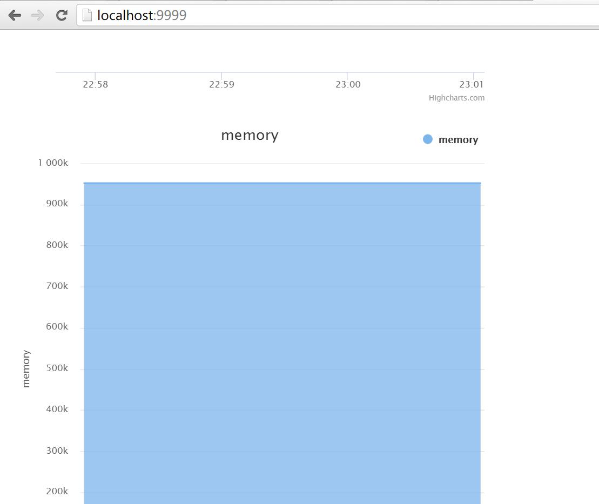

# redismonitor
`It is a redis monitor browser`

## Usage:
```
1.cd node_modules\redismonitor
2.node index.js --redisIp=<redisIp> --redisPort=<redisPort> //default value for redisIp and redisPort are localhost and 6379
3.open your browser and go to localhost:8888
```

## Note
```
Currently what to be shown could be configured
You could define your monitor through modify js/config.js
For example, if you open js/config.js,you could see:

        var compos = [
                ['longest-output-list', 'client_longest_output_list'],
                ['memory', 'used_memory'],
                ['connection', 'total_connections_received'],
        ]

if you do not wanna monitor memory, just delete the memory item
if you do wanna add monitor item, you could add a line to the end of compos as below, where cc
is the name of monitor, and connected_clients is the field to monitor, you could find this in 'redis-cli info'
         var compos = [
                ['longest-output-list', 'cliient_longest_output_list'],
                ['memory', 'used_memory'],
                ['connection', 'total_connections_received'],
                ['cc', 'connected_clients'],
        ]
```

## Example

# Enjoy